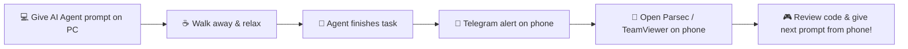

# telegram-notifier

▲ **Skills** • **AI Agents** • **Remote Dev**

Universal **Telegram notification skill & plugin** for AI coding agents: real-time alerts on your phone whenever tasks finish, human approvals are needed, or errors occur + **Parsec** mobile remote control guide.

**Best use**: let your AI agent do the heavy lifting (builds, migrations, tests, code refactoring), step away from your desk, get notified on Telegram (`Task Finished` or `"خلصت يا معلم"`), and instantly control your PC from your smartphone via Parsec.

---

## ⚡ Install

Browse the package first:

```bash
npx skills add alhinawi/telegram-notifier --list
```

Install the package:

```bash
npx skills add alhinawi/telegram-notifier
```

Or run the interactive setup wizard directly: (Recommended)

```bash
npx github:alhinawi/telegram-notifier
```

---

## 🤖 1-Click Prompt for AI Agents

Give this prompt to your AI Agent (Antigravity, Claude Code, Cursor, Windsurf, Copilot) to install and configure everything automatically:

### 🇬🇧 English Prompt

```text
Please install and configure the telegram-notifier skill by running `npx skills add alhinawi/telegram-notifier` (or via https://github.com/alhinawi/telegram-notifier). Follow the setup instructions to configure the bot token and chat ID, and make sure to automatically trigger a Telegram notification whenever you finish a task, need my approval, or encounter an error.
```

### 🇪🇬 Arabic Prompt (برومبت بالعربي)

```text
من فضلك قم بتثبيت وإعداد مهارة telegram-notifier عبر تشغيل الأمر `npx skills add alhinawi/telegram-notifier` (أو من المستودع https://github.com/alhinawi/telegram-notifier). اتبع خطوات الإعداد لربط الـ Bot Token والـ Chat ID، واحرص على إرسال إشعار تليجرام تلقائياً في كل مرة تنتهي فيها من مهمة، أو تحتاج إذني وموافقتي، أو عند حدوث أي خطأ بدون أن أحتاج لتشغيلها يدوياً.
```

---

## 🌟 What the Setup Wizard Does

When you run `npx github:alhinawi/telegram-notifier` or configure the skill:

1. 🔑 **Telegram Bot Token**: Asks for your token from `@BotFather`.
2. 🔍 **Auto-detect Chat ID**: Listens for `/start` sent to your bot and detects your Chat ID automatically.
3. 🌐 **Language Preference**: Choose English (`en` - default), Egyptian Arabic (`ar-eg`), or Standard Arabic (`ar`).
4. ⚙️ **Installation Scope**:
   - **Global**: Automatically activates for all projects and AI agents on your machine.
   - **Local**: Configures rules and skills inside the current repository.
5. 🔔 **Live Test**: Sends an instant test notification to your phone to confirm everything is working!

---

## 🌐 Language Options & Presets

You can configure the language in `.env` (`NOTIFICATION_LANGUAGE=en|ar-eg|ar`) or specify `--lang` per call:

| Event Type | English (Default `en`) | Egyptian Arabic (`ar-eg`) | Standard Arabic (`ar`) |
| --- | --- | --- | --- |
| `--type=task_finished` | `Task Finished` | `خلصت يا معلم` | `اكتملت المهمة بنجاح` |
| `--type=approval_required` | `Approval Required` | `محتاج اذنك يا معلم` | `مطلوب مراجعة وتأكيد` |
| `--type=error` | `Error Occurred` | `فيه مشكلة يا معلم` | `حدث خطأ أثناء التنفيذ` |

---

## ⚙️ How AI Agents Trigger It Automatically

### 1. Antigravity & Gemini CLI

Installed globally in `~/.gemini/config/plugins/telegram-notifier/` or locally in `.agents/skills/telegram-notifier/`. The agent detects the skill and triggers it automatically.

### 2. Claude Code

Add to `.claude/skills/telegram-notifier/SKILL.md` or instruct in `CLAUDE.md`:

```markdown
When you finish a task, need approval, or encounter an error, automatically run:
node /path/to/telegram-notifier/scripts/notify.js --type="task_finished" --message="Summary of changes"
```

### 3. Cursor & Windsurf

Add to `.cursorrules` or `.windsurfrules`:

```markdown
When completing any task, needing human approval, or encountering an error:
Execute `node /path/to/telegram-notifier/scripts/notify.js --type=task_finished`
```

---

## 💻 Remote Desktop & Mobile Control Guide (التحكم في الكمبيوتر من الموبايل)

### Option 1: Parsec (Recommended for Android / PC / Mac)

[Parsec](https://parsec.app/) is a free, ultra-low latency, 60 FPS remote desktop application. It lets you control your PC from your smartphone with zero perceived lag and full desktop interactivity.

#### A. PC Host Setup (Desktop / Workstation)

1. Download and install **Parsec** from [parsec.app](https://parsec.app/).
2. Create a free account and log in.
3. In **Settings -> Host**, ensure **Hosting** is set to `Enabled`.
4. Keep Parsec running in the background.

#### B. Mobile App Setup (Android)

1. Download **Parsec** from Google Play Store.
2. Log in with the **same account** used on your PC.
3. Under **Computers**, tap **Connect** to mirror your PC screen with touch/mouse controls!

---

### Option 2: TeamViewer (Recommended for iPhone / iOS Users)

For iPhone (iOS) users, [TeamViewer](https://www.teamviewer.com/) provides a smooth, reliable remote desktop experience:

#### A. PC Host Setup

1. Download and install **TeamViewer Remote** from [teamviewer.com](https://www.teamviewer.com/).
2. Create a free account and log in.
3. Enable **Easy Access** under Security Settings to connect without typing a password every time.

#### B. iPhone (iOS) App Setup

1. Download **TeamViewer Remote Control** from the [App Store](https://apps.apple.com/app/teamviewer-remote-control/id692035811).
2. Log in with the same account and tap on your PC under **My Devices** to connect instantly!

---

### 🔁 The Ultimate Mobile Remote Dev Workflow



1. **Start Task**: Give your AI agent a task on your PC (e.g. "Build feature X and run test suite").
2. **Step Away**: Leave your desk, grab coffee, or relax.
3. **Get Notified**: Your phone receives a Telegram alert: `✅ [Task Finished] "Task Finished" (or "خلصت يا معلم")`.
4. **Take Control**: Open **Parsec** (Android) or **TeamViewer** (iOS) on your phone, connect to your PC, inspect the results, approve code, or give the agent its next prompt!

---

## 🔒 Security Notice

- **Never commit `.env` to Git repositories.** `.gitignore` is pre-configured to protect your secrets.
- Always keep your `TELEGRAM_BOT_TOKEN` private. If leaked, revoke it via `@BotFather` using `/revoke`.

---

## 📄 License

This project is open-source and available under the [MIT License](LICENSE).
