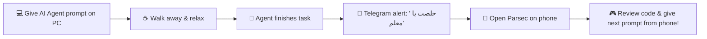

# 🚀 Telegram Notifier & Remote Control Guide for AI Agents

> **Universal Telegram notification plugin & skill for AI Coding Agents** (Antigravity, Claude Code, Cursor, Windsurf, Gemini CLI, CI/CD pipelines, and standalone scripts) + **Parsec Remote Desktop Integration Guide**.

---

## 🌟 Overview

When working with modern AI coding agents, long-running tasks like builds, multi-file refactoring, database migrations, or test suite runs often require time to execute. Instead of sitting in front of your PC waiting, **Telegram Notifier** alerts your mobile phone in real-time when:

- ✅ **Task Finishes**: When an AI agent or build completes successfully.
- ⚠️ **Approval Required**: When human feedback, plan review, or confirmation is needed.
- ❌ **Error Occurred**: When a command, test, or build fails.

Paired with **Parsec**, you get total freedom: get notified on your phone, open Parsec, and instantly review & control your workstation from anywhere!

---

## ⚡ Features

- 🤖 **Universal AI Agent Support**: Compatible with Antigravity, Claude Code, Cursor, Windsurf, Gemini CLI, Git Hooks, and CI/CD pipelines.
- 💬 **Customizable Tone**: Built-in support for Egyptian Arabic & custom notification titles (`"خلصت يا معلم"`, `"محتاج اذنك يا معلم"`, `"فيه مشكلة يا معلم"`).
- 🔍 **Auto Chat ID Detection**: Auto-discovers your Telegram Chat ID with a single command (`npm run detect-chat-id`).
- ⚡ **Zero Dependencies**: Built with native Node.js (`https` module) — no external `npm` dependencies required.
- 🔒 **Security First**: Credentials are kept strictly in `.env` and excluded from Git commits.

---

## 📲 Step 1: Telegram Bot & Credentials Setup

### 1. Create a Telegram Bot
1. Open Telegram and search for `@BotFather`.
2. Send `/newbot` and follow the on-screen instructions to set a name and username for your bot.
3. `@BotFather` will give you an **HTTP API Token** (e.g. `1234567890:ABCdefGhIJKlmNoPQRsTUVwxyZ`).

### 2. Configure `.env`
1. Clone this repository or copy the files to your machine.
2. Duplicate `.env.example` to `.env`:
   ```bash
   cp .env.example .env
   ```
3. Open `.env` and paste your bot token:
   ```env
   TELEGRAM_BOT_TOKEN=your_bot_token_here
   TELEGRAM_CHAT_ID=your_chat_id_here
   ```

### 3. Auto-Detect Your `TELEGRAM_CHAT_ID`
1. Open Telegram and search for your newly created bot.
2. Click **Start** or send any message to the bot (e.g., `Hello`).
3. Run the auto-detection script in your terminal:
   ```bash
   npm run detect-chat-id
   ```
4. The script will automatically fetch your Chat ID and write it directly into your `.env` file! 🎉

---

## 🤖 Step 2: Connecting to ANY AI Agent

### 1. Antigravity / Gemini CLI
Add this repository as a global plugin or copy `skills/telegram-notifier/SKILL.md` to your skills folder:
- **Location**: `~/.gemini/config/plugins/telegram-notifier/`

### 2. Claude Code
Copy `skills/telegram-notifier/SKILL.md` into your project's `.claude/skills/telegram-notifier/SKILL.md` or instruct Claude in `CLAUDE.md`:
```markdown
When you finish a task, need approval, or encounter an error, run:
node /path/to/telegram-notifier/scripts/notify.js --type="task_finished" --title="خلصت يا معلم" --message="Summary of changes"
```

### 3. Cursor & Windsurf
Add the following rule to your `.cursorrules` or `.windsurfrules`:
```markdown
After completing work or when waiting for user input/approval:
Execute `node /path/to/telegram-notifier/scripts/notify.js --type=task_finished --title="خلصت يا معلم" --message="Completed prompt"`
```

### 4. Direct CLI / Terminal / Git Hooks
You can trigger notifications directly from any shell or PowerShell:

**Node.js / Terminal:**
```bash
node scripts/notify.js --type=task_finished --title="خلصت يا معلم" --message="Build succeeded with 0 errors" --project="my-awesome-app"
```

**PowerShell (Windows):**
```powershell
.\scripts\notify.ps1 -Type "approval_required" -Title "محتاج اذنك يا معلم" -Message "Plan review required" -Project "my-awesome-app"
```

---

## 💻 Step 3: Parsec Integration Guide (التحكم في الكمبيوتر من الموبايل)

### What is Parsec?
[Parsec](https://parsec.app/) is a ultra-low latency, 60 FPS remote desktop application designed for gaming and real-time interactive work. It allows you to control your PC from your smartphone or laptop with zero perceived lag and crystal-clear display.

---

### How to Set Up Parsec for Mobile Remote Control

#### A. PC Host Setup (Desktop / Workstation)
1. Download and install **Parsec** for Windows/macOS from [parsec.app](https://parsec.app/).
2. Create a free Parsec account and log in.
3. In **Settings -> Host**:
   - Ensure **Hosting** is enabled (`Enabled`).
   - Set resolution preference to match your PC display.
4. Keep Parsec running in the background.

#### B. Mobile App Setup (Smartphone)
1. Download **Parsec** from Google Play Store (Android) or App Store (iOS).
2. Log in with the **same account** used on your PC.
3. You will see your host PC listed under **Computers**.
4. Click **Connect** — your phone screen instantly mirrors your PC desktop with touch/mouse controls!

---

### 🔁 The Ultimate Mobile Remote Dev Workflow



1. **Start Task**: Give your AI agent a task on your PC (e.g. "Build feature X and run test suite").
2. **Step Away**: Leave your desk, grab coffee, or relax.
3. **Get Notified**: Your phone receives a Telegram alert: `✅ [Task Finished] "خلصت يا معلم"`.
4. **Take Control**: Open **Parsec** on your phone, connect to your PC, inspect the results, approve code, or give the agent its next prompt!

---

## 📖 Command Line Options

| Parameter | Required | Description | Example Values |
|---|---|---|---|
| `--type` | No | Notification category | `task_finished`, `approval_required`, `error` |
| `--title` | No | Alert headline | `"خلصت يا معلم"`, `"Build Passed"` |
| `--message` | No | Main details/body | `"All 42 tests passed in 12s"` |
| `--project` | No | Name of workspace | `"admin-dashboard"` |

---

## 🔒 Security Notice

- **Never commit `.env` to Git repositories.** `.gitignore` is pre-configured to prevent accidental leaks.
- Always keep your `TELEGRAM_BOT_TOKEN` private. If leaked, revoke it via `@BotFather` using `/revoke`.

---

## 📄 License

This project is open-source and available under the [MIT License](LICENSE).
