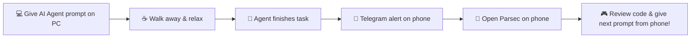

# 🚀 Telegram Notifier & Remote Control Guide for AI Agents

> **Universal Telegram notification plugin & skill for AI Coding Agents** (Antigravity, Claude Code, Cursor, Windsurf, Gemini CLI, CI/CD pipelines, Git hooks, and scripts) + **Parsec Remote Desktop Setup Guide**.

---

## 🌟 Overview

When working with modern AI coding agents, long-running tasks like builds, multi-file refactoring, database migrations, or test suite runs often require time to execute. Instead of sitting in front of your PC waiting, **Telegram Notifier** alerts your mobile phone in real-time when:

- ✅ **Task Finishes**: When an AI agent or build completes successfully (`Task Finished` or `"خلصت يا معلم"`).
- ⚠️ **Approval Required**: When human feedback, plan review, or confirmation is needed (`Approval Required` or `"محتاج اذنك يا معلم"`).
- ❌ **Error Occurred**: When a command, test, or build fails (`Error Occurred` or `"فيه مشكلة يا معلم"`).

Paired with **Parsec**, you get total freedom: get notified on your phone, open Parsec, and instantly review & control your workstation from anywhere!

---

## ⚡ Features

- 🧙‍♂️ **Interactive CLI Setup Wizard**: Run `npm run setup` for a 1-click guided setup that configures tokens, detects your chat ID, picks your language, and sends a test message.
- 🤖 **Universal AI Agent Support**: Compatible with Antigravity, Claude Code, Cursor, Windsurf, Gemini CLI, Git Hooks, and CI/CD pipelines.
- 🌐 **Multi-Language Presets**: Default English (`en`), Egyptian Arabic (`ar-eg`), and Modern Standard Arabic (`ar`), plus custom titles.
- 🔍 **Auto Chat ID Detection**: Auto-discovers your Telegram Chat ID automatically by reading updates from your bot.
- ⚙️ **Global or Local Auto-Triggering**: Install globally for all projects on your machine, or scope it locally per repository so AI agents notify you automatically without manual commands.
- ⚡ **Zero External Dependencies**: Built with native Node.js (`https`, `readline`, `fs`, `path`) — runs instantly on any machine.
- 🔒 **Security First**: Credentials are kept strictly in `.env` and ignored by Git.

---

## 🚀 Quick Start (Interactive Setup Wizard)

The fastest way to set up everything is using the interactive wizard:

```bash
# 1. Clone the repository
git clone https://github.com/alhinawi/telegram-notifier.git
cd telegram-notifier

# 2. Run the interactive setup wizard
npm run setup
```

The wizard will guide you through:
1. 🔑 Entering your **Telegram Bot Token** (from `@BotFather`).
2. 🔍 **Auto-detecting your Chat ID** (just send `/start` to your bot).
3. 🌐 Choosing your **Language** (English / Egyptian Arabic / Standard Arabic).
4. ⚙️ Selecting **Installation Scope** (Global plugin or Local workspace).
5. 🔔 Sending a live **Test Notification** to your phone!

---

## 🤖 1-Click Installation Prompts for AI Agents

You can simply copy and paste either of the following prompts directly to your AI Coding Agent (Antigravity, Claude Code, Cursor Composer, Windsurf Cascade, etc.) to have it set up everything automatically:

### 🇬🇧 English Prompt
```text
Please install and configure the telegram-notifier tool from https://github.com/alhinawi/telegram-notifier into this workspace/environment. Follow its setup instructions to configure the skill and rules, and ensure you automatically trigger a Telegram notification whenever you finish a task, need my approval, or encounter an error.
```

### 🇪🇬 Arabic Prompt (برومبت بالعربي)
```text
من فضلك قم بتثبيت وإعداد أداة telegram-notifier من المستودع https://github.com/alhinawi/telegram-notifier في بيئة العمل الحالية. اتبع تعليمات الإعداد لتفعيل الـ Skill والقواعد، واحرص على إرسال إشعار تليجرام تلقائياً في كل مرة تنتهي فيها من مهمة، أو تحتاج إذني وموافقتي، أو عند حدوث أي خطأ بدون أن أحتاج لتشغيلها يدوياً.
```

---

## 📲 Step-by-Step Manual Setup

### 1. Create a Telegram Bot
1. Open Telegram and search for `@BotFather`.
2. Send `/newbot` and follow the on-screen instructions to set a name and username for your bot.
3. `@BotFather` will give you an **HTTP API Token** (e.g. `1234567890:ABCdefGhIJKlmNoPQRsTUVwxyZ`).

### 2. Configure `.env`
1. Duplicate `.env.example` to `.env`:
   ```bash
   cp .env.example .env
   ```
2. Set your credentials and preferred language:
   ```env
   TELEGRAM_BOT_TOKEN=your_bot_token_here
   TELEGRAM_CHAT_ID=your_chat_id_here
   NOTIFICATION_LANGUAGE=en
   ```

### 3. Auto-Detect Your `TELEGRAM_CHAT_ID`
1. Open Telegram and search for your newly created bot.
2. Click **Start** or send any message to the bot (e.g., `Hello`).
3. Run:
   ```bash
   npm run detect-chat-id
   ```
4. The script will automatically fetch your Chat ID and write it directly into your `.env` file!

---

## 🌐 Language Options & Presets

You can configure the language globally in `.env` (`NOTIFICATION_LANGUAGE=en|ar-eg|ar`) or specify `--lang` per call:

| Event Type | English (Default `en`) | Egyptian Arabic (`ar-eg`) | Standard Arabic (`ar`) |
|---|---|---|---|
| `--type=task_finished` | `Task Finished` | `خلصت يا معلم` | `اكتملت المهمة بنجاح` |
| `--type=approval_required` | `Approval Required` | `محتاج اذنك يا معلم` | `مطلوب مراجعة وتأكيد` |
| `--type=error` | `Error Occurred` | `فيه مشكلة يا معلم` | `حدث خطأ أثناء التنفيذ` |

---

## ⚙️ Connecting to ANY AI Agent

### 1. Antigravity / Gemini CLI
- **Global Installation**:
  Copy the folder to `~/.gemini/config/plugins/telegram-notifier/`.
- **Local Project**:
  Place `skills/telegram-notifier/SKILL.md` inside `.agents/skills/telegram-notifier/SKILL.md`.

### 2. Claude Code
Add to `.claude/skills/telegram-notifier/SKILL.md` or instruct in `CLAUDE.md`:
```markdown
When you finish a task, need approval, or encounter an error, automatically run:
node /path/to/telegram-notifier/scripts/notify.js --type="task_finished" --message="Summary of changes"
```

### 3. Cursor & Windsurf
Add to `.cursorrules` or `.windsurfrules`:
```markdown
When completing any task, needing human approval, or encountering an error:
Execute `node /path/to/telegram-notifier/scripts/notify.js --type=task_finished`
```

### 4. Direct CLI / Terminal / PowerShell
```bash
# Node.js
node scripts/notify.js --type=task_finished --message="Build complete with 0 errors" --project="my-app"

# Egyptian Arabic Tone
node scripts/notify.js --type=task_finished --lang="ar-eg" --message="الفرونت إند والباك إند تمام"

# PowerShell (Windows)
.\scripts\notify.ps1 -Type "approval_required" -Title "Approval Needed" -Message "Plan review required"
```

---

## 💻 Parsec Integration Guide (التحكم في الكمبيوتر من الموبايل)

### What is Parsec?
[Parsec](https://parsec.app/) is a free, ultra-low latency, 60 FPS remote desktop application designed for gaming and real-time interactive work. It allows you to control your PC from your smartphone or laptop with zero perceived lag and crystal-clear display.

---

### How to Set Up Parsec for Mobile Remote Control

#### A. PC Host Setup (Desktop / Workstation)
1. Download and install **Parsec** for Windows/macOS from [parsec.app](https://parsec.app/).
2. Create a free Parsec account and log in.
3. In **Settings -> Host**:
   - Ensure **Hosting** is set to `Enabled`.
   - Keep Parsec running in the system tray.

#### B. Mobile App Setup (Smartphone)
1. Download **Parsec** from Google Play Store (Android) or App Store (iOS).
2. Log in with the **same account** used on your PC.
3. Under **Computers**, tap **Connect** to mirror your PC screen with touch/mouse controls!

---

### 🔁 The Ultimate Mobile Remote Dev Workflow



1. **Start Task**: Give your AI agent a task on your PC (e.g. "Build feature X and run test suite").
2. **Step Away**: Leave your desk, grab coffee, or relax.
3. **Get Notified**: Your phone receives a Telegram alert: `✅ [Task Finished] "Task Finished" (or "خلصت يا معلم")`.
4. **Take Control**: Open **Parsec** on your phone, connect to your PC, inspect the results, approve code, or give the agent its next prompt!

---

## 🔒 Security Notice

- **Never commit `.env` to Git repositories.** `.gitignore` is pre-configured to protect your secrets.
- Always keep your `TELEGRAM_BOT_TOKEN` private. If leaked, revoke it via `@BotFather` using `/revoke`.

---

## 📄 License

This project is open-source and available under the [MIT License](LICENSE).
