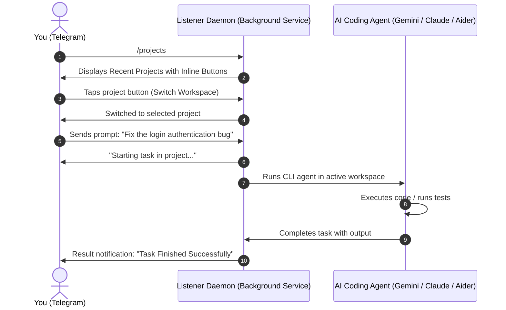

# telegram-notifier

**Skills** • **AI Agents** • **Two-Way Control Bridge** • **Remote Dev**

Universal **Telegram notification & interactive control bridge** for AI coding agents: real-time alerts on your phone whenever tasks finish, human approvals with interactive buttons, plus **two-way control** to execute prompts, switch workspaces, and stop tasks directly from your smartphone!



---

## Quick Start

Install the skill across all your AI coding agents (Cursor, Claude Code, Antigravity, Windsurf):

```bash
npx skills add alhinawi/telegram-notifier
```

After installation, run the interactive setup wizard once to link your Telegram Bot and start the background service:

```bash
npm run setup
```

The wizard will:

1. Connect your Telegram Bot Token and auto-detect your Chat ID.
2. Configure workspace folders for scanning recent projects (`WORKSPACE_DIRS`).
3. Set your preferred AI Agent CLI tool (`gemini`, `claude`, `aider`).
4. Auto-install and start the background daemon service (`launchd` on macOS, `systemd` on Linux, Startup on Windows).

---

## How to Update

To update the skill to the latest version at any time:

```bash
npx skills update telegram-notifier
```

---

## Two-Way Interactive Bridge

With the interactive daemon running, your Telegram Bot becomes a full two-way command center:

### Telegram Commands

| Command            | Action                                                                                   |
| ------------------ | ---------------------------------------------------------------------------------------- |
| `/projects`        | Displays your most recently edited projects with inline buttons to switch workspace      |
| `/cd <path/name>`  | Switch active project directory directly (supports `~`, relative paths, or project name) |
| `/dirs`            | View scanned workspace roots and active directory                                        |
| `/add_dir <path>`  | Add a new root directory for project scanning                                            |
| `/del_dir <path>`  | Remove a root directory from project scanning                                            |
| `/language`        | Switch notification and bot language via clickable interactive list                      |
| `/status`          | Shows daemon health, active project, git branch, and running task status                 |
| `/stop`            | Aborts the currently executing task on your machine                                      |
| `/help`            | Shows command guide and instructions                                                     |
| _Any text message_ | Executed immediately as a prompt by your AI Agent inside the active workspace            |

### Interactive Approval Buttons

When an AI Agent requests human feedback or approval, it sends interactive buttons directly to your Telegram chat:

- **Approve / موافق**
- **Reject / رفض**

Tapping the button immediately sends your decision back to the running process.

---

## Background Daemon Service Management

The daemon can run in the foreground or as a persistent system background service:

```bash
# Foreground run (useful for testing)
npm run daemon

# Install as background service (auto-starts on system boot)
npm run service:install

# Check background service status and logs
npm run service:status

# Stop and uninstall background service
npm run service:uninstall

# Restart background service
npm run service:restart
```

### Supported Operating Systems

- **macOS**: Configures a user `launchd` agent in `~/Library/LaunchAgents/com.telegram-notifier.daemon.plist`
- **Linux**: Configures a user `systemd` unit in `~/.config/systemd/user/telegram-notifier.service`
- **Windows**: Configures startup launcher in `%APPDATA%\Microsoft\Windows\Start Menu\Programs\Startup`

---

## 1-Click Prompt for AI Agents

Give this prompt to your AI Agent (Antigravity, Claude Code, Cursor, Windsurf, Copilot) to install and configure everything automatically:

### English Prompt

```text
Please install and configure the telegram-notifier skill by running `npx skills add alhinawi/telegram-notifier` (or via https://github.com/alhinawi/telegram-notifier). Follow the setup instructions to configure the bot token and chat ID, and make sure to automatically trigger a Telegram notification whenever you finish a task, need my approval, or encounter an error.
```

### Arabic Prompt (برومبت بالعربي)

```text
من فضلك قم بتثبيت وإعداد مهارة telegram-notifier عبر تشغيل الأمر `npx skills add alhinawi/telegram-notifier` (أو من المستودع https://github.com/alhinawi/telegram-notifier). اتبع خطوات الإعداد لربط الـ Bot Token والـ Chat ID، واحرص على إرسال إشعار تليجرام تلقائياً في كل مرة تنتهي فيها من مهمة، أو تحتاج إذني وموافقتي، أو عند حدوث أي خطأ بدون أن أحتاج لتشغيلها يدوياً.
```

---

## Language Options & Presets

You can configure the language in `.env` (`NOTIFICATION_LANGUAGE=en|ar`) or specify `--lang` per call:

| Event Type                 | English (`en`)      | Arabic (`ar`)           |
| -------------------------- | ------------------- | ----------------------- |
| `--type=task_finished`     | `Task Finished`     | `اكتملت المهمة بنجاح`   |
| `--type=approval_required` | `Approval Required` | `مطلوب مراجعة وتأكيد`   |
| `--type=error`             | `Error Occurred`    | `حدث خطأ أثناء التنفيذ` |

---

## How AI Agents Trigger Notifications

### 1. Installed via Skills CLI (Recommended)

When installed via `npx skills add alhinawi/telegram-notifier`, your AI Agent (Cursor, Claude Code, Antigravity, Windsurf) automatically discovers the skill from `SKILL.md` and triggers notifications without manual configuration.

### 2. Antigravity & Gemini CLI

Installed globally via `npm run setup` in `~/.gemini/config/plugins/telegram-notifier/` or via `npx skills add alhinawi/telegram-notifier -g`. The agent detects the skill and triggers it automatically.

### 3. Claude Code

Install via `npx skills add alhinawi/telegram-notifier -a claude-code` or instruct in `CLAUDE.md`:

```markdown
When completing any task, needing human approval, or encountering an error:
Execute `node /path/to/telegram-notifier/scripts/notify.js --type="task_finished" --message="Summary of changes"`
```

### 4. Cursor & Windsurf

Install via `npx skills add alhinawi/telegram-notifier` or add to `.cursorrules` / `.windsurfrules`:

```markdown
When completing any task, needing human approval, or encountering an error:
Execute `node /path/to/telegram-notifier/scripts/notify.js --type=task_finished`
```

---

## Remote Desktop & Mobile Control Guide (التحكم في الكمبيوتر من الموبايل)

### Option 1: Parsec (Recommended for Android / PC / Mac)

[Parsec](https://parsec.app/) is a free, ultra-low latency, 60 FPS remote desktop application. It lets you control your PC from your smartphone with zero perceived lag and full desktop interactivity.

#### A. PC Host Setup (Desktop / Workstation)

1. Download and install **Parsec** from [parsec.app](https://parsec.app/).
2. Create a free account and log in.
3. In **Settings -> Host**, ensure **Hosting** is set to `Enabled`.
4. Keep Parsec running in the background.

#### B. Mobile App Setup (Android)

1. Download **Parsec** from Google Play Store.
2. Log in with the **same account** used on your PC.
3. Under **Computers**, tap **Connect** to mirror your PC screen with touch/mouse controls!

---

### Option 2: TeamViewer (Recommended for iPhone / iOS Users)

For iPhone (iOS) users, [TeamViewer](https://www.teamviewer.com/) provides a smooth, reliable remote desktop experience:

#### A. PC Host Setup

1. Download and install **TeamViewer Remote** from [teamviewer.com](https://www.teamviewer.com/).
2. Create a free account and log in.
3. Enable **Easy Access** under Security Settings to connect without typing a password every time.

#### B. iPhone (iOS) App Setup

1. Download **TeamViewer Remote Control** from the [App Store](https://apps.apple.com/app/teamviewer-remote-control/id692035811).
2. Log in with the same account and tap on your PC under **My Devices** to connect instantly!

---

## Security Notice

- **Strict Authorization**: The listener daemon checks every incoming message's Chat ID against `TELEGRAM_CHAT_ID`. Only you can trigger commands.
- **Never commit `.env` to Git repositories.** `.gitignore` is pre-configured to protect your secrets.
- Always keep your `TELEGRAM_BOT_TOKEN` private. If leaked, revoke it via `@BotFather` using `/revoke`.

---

## License

This project is open-source and available under the [MIT License](LICENSE).
